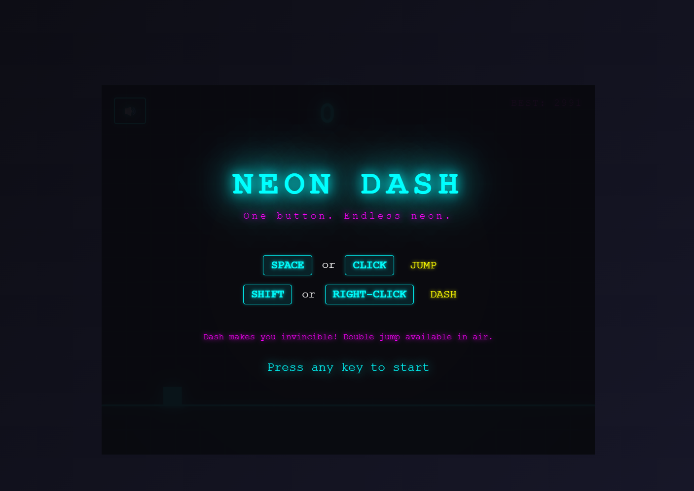

# Neon Dash

<p align="center">
  
  
  
</p>

A sleek one-button endless runner with striking neon aesthetics. Survive as long as possible, dodge obstacles, and chase high scores in this addictive arcade experience.



## Features

- **One-Button Gameplay** - Simple controls, deep challenge
- **Neon Visuals** - Glowing effects, particle systems, screen shake
- **Power-Ups** - Shield, Slow Motion, 2x Score, Ghost Mode
- **Progressive Difficulty** - Speed and obstacle frequency increase over time
- **Persistent High Scores** - Best score saved locally
- **Sound Toggle** - Audio can be muted/unmuted
- **Mobile Support** - Touch controls for mobile devices

## Controls

| Action | Keyboard | Mouse/Touch |
|--------|----------|--------------|
| Jump | `Space` | Left Click / Tap |
| Dash | `Shift` | Right Click |

- **Dash** makes you invincible for a short duration
- **Double jump** available while airborne

## Getting Started

### Run Locally

```bash
# Clone the repository
git clone https://github.com/yourusername/neon-dash.git
cd neon-dash

# Start the development server
pnpm run dev
```

Then open [http://localhost:3000](http://localhost:3000) in your browser.

### Or Simply Open

Just open `index.html` directly in any modern browser - no build step required.

## Game Mechanics

- **Scoring**: +1 point per frame survived, +50 bonus for passing obstacles
- **Difficulty**: Speed increases every 400 points
- **Power-ups**: Unlock at score milestones (random drops)

## Tech Stack

- Pure JavaScript (no frameworks)
- HTML5 Canvas for rendering
- Web Audio API for sound
- localStorage for persistence

## Project Structure

```
neon-dash/
├── index.html    # Game canvas and UI
├── style.css    # Neon styling
├── game.js      # All game logic
├── SPEC.md      # Game specification
└── package.json
```

## License

MIT License - feel free to use, modify, and distribute.

---

<p align="center">
  <sub>Built with</sub> <br>
  <a href="#"></a>
  <a href="#"></a>
</p>